# Kirana Demand Forecasting & Automated Reordering System
## Complete Technical Documentation

**A production-grade continuous-learning system that forecasts SKU-level demand distributions (P50/P90/P95/P99) and automatically decides *when* and *how much* to reorder for small retail (kirana) stores at chain scale.**

---

## 📋 Table of Contents

1. [System Overview](#system-overview)
2. [Architecture & Data Flow](#architecture--data-flow)
3. [What is Built](#what-is-built)
4. [Why This Approach](#why-this-approach)
5. [How It Works](#how-it-works)
   - [Phase 1: Data Ingestion & Validation](#phase-1-data-ingestion--validation)
   - [Phase 2-3: Data Preparation & Cleaning](#phase-2-3-data-preparation--cleaning)
   - [Phase 4: Feature Engineering](#phase-4-feature-engineering)
   - [Phase 5: Model Building (Forecasting)](#phase-5-model-building)
   - [Phase 6: Hybrid Continuous Learning](#phase-6-hybrid-continuous-learning)
   - [Phase 7: Reorder Decision Layer](#phase-7-reorder-decision-layer)
   - [Phase 8-10: Evaluation & Deployment](#phase-8-10-evaluation--deployment)
6. [Implementation Details](#implementation-details)
7. [Technology Stack](#technology-stack)
8. [Key Design Decisions](#key-design-decisions)
9. [Results & Validation](#results--validation)

---

## System Overview

### The Problem
Small kirana stores manage hundreds of SKUs with **gut-feel reordering**, resulting in:
- **Stockouts** on fast movers → lost sales & customers
- **Overstock** on slow movers → dead capital, waste on perishables
- **No affordable ML** that learns from daily sales

### The Solution
A two-part coupled system:

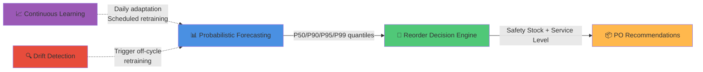

**Key Insight:** Forecast distributions, not point estimates. Use upper quantiles (P90/P95/P99) as the basis for safety stock calculations.

---

## Architecture & Data Flow

### 🏗️ Complete System Architecture

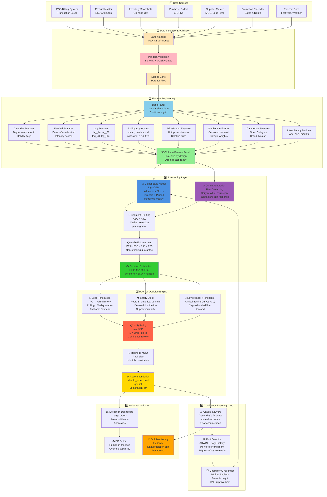

### Daily Continuous Learning Loop

```mermaid
graph TB
    subgraph "Daily Cycle"
        INGEST["1️⃣ INGEST<br/>Yesterday's sales<br/>+ receipts (GRN)<br/>+ inventory snapshots"]
        UPDATE["2️⃣ UPDATE FEATURES<br/>Append lags for new day<br/>Update rolling aggregates<br/>DuckDB window functions"]
        ONLINE_UPD["3️⃣ ONLINE LAYER UPDATE<br/>Fit on yesterday's<br/>residuals (River)<br/>← Daily adaptation"]
        SCORE["4️⃣ SCORE<br/>Produce P50/P90/P95<br/>for horizon<br/>Non-crossing enforcement"]
        REORDER["5️⃣ REORDER ENGINE<br/>Compute ROP (s)<br/>Order-up-to (S)<br/>Order qty recommendation"]
        LOG["6️⃣ LOG ACTUALS<br/>When next day arrives:<br/>compute forecast error<br/>Accumulate error stream"]
        DRIFT_CHK["7️⃣ DRIFT CHECK<br/>ADWIN/PageHinkley<br/>per segment<br/>Error distribution shift?"]
        SCHEDULED["8️⃣ SCHEDULED RETRAIN<br/>IF (cadence met)<br/>OR (drift fired):<br/>retrain base model"]
        PROMOTE["9️⃣ CHAMPION/CHALLENGER<br/>New model vs current<br/>Promote only if +2%<br/>improvement (WAPE)"]
        REPEAT["🔟 REPEAT<br/>Continuous cycle"]
    end
    
    INGEST --> UPDATE
    UPDATE --> ONLINE_UPD
    ONLINE_UPD --> SCORE
    SCORE --> REORDER
    REORDER --> LOG
    LOG --> DRIFT_CHK
    DRIFT_CHK --> SCHEDULED
    SCHEDULED --> PROMOTE
    PROMOTE --> REPEAT
    REPEAT -.->|Next Day| INGEST
    
    style INGEST fill:#FFE5B4
    style UPDATE fill:#87CEEB
    style ONLINE_UPD fill:#9B59B6
    style SCORE fill:#32CD32
    style REORDER fill:#FF6347
    style LOG fill:#4A90E2
    style DRIFT_CHK fill:#E74C3C
    style SCHEDULED fill:#FFD700
    style PROMOTE fill:#FFA500
```

---

## What is Built

### Completed Phases (✅ Delivered)

| Phase | Component | Status | Key Deliverable |
|-------|-----------|--------|-----------------|
| **Phase 0** | Foundations | ✅ | Problem framing, design principles, locked config |
| **Phase 1** | Data Ingestion | ✅ | Canonical schema, pandera validation, data contract |
| **Phase 2-3** | Data Prep & Cleaning | ✅ | Continuous (store×sku×date) grid, leak-free splits, censoring |
| **Phase 4** | Feature Engineering | ✅ | 55-column feature panel, DuckDB window functions, no leakage |
| **Phase 5** | Model Building | ✅ | Global LightGBM (tweedie + pinball), quantile heads, champion model |
| **Phase 6** | Continuous Learning | ✅ | River online layer, drift detectors (ADWIN/PageHinkley), MLflow registry |
| **Phase 7** | Reorder Layer | ✅ | (s,S) policy, newsvendor for perishables, lead-time estimation, safety stock |
| **Phase 8** | Acceptance Gate | ✅ | Inventory simulation, service-vs-inventory frontier analysis |
| **Phase 9** | Deployment | ✅ | FastAPI serving, batch prediction tables, PO dashboard |
| **Phase 10** | Monitoring | ✅ | Evidently drift dashboards, actuals logging, feedback loops |

---

## Why This Approach

### Design Principles

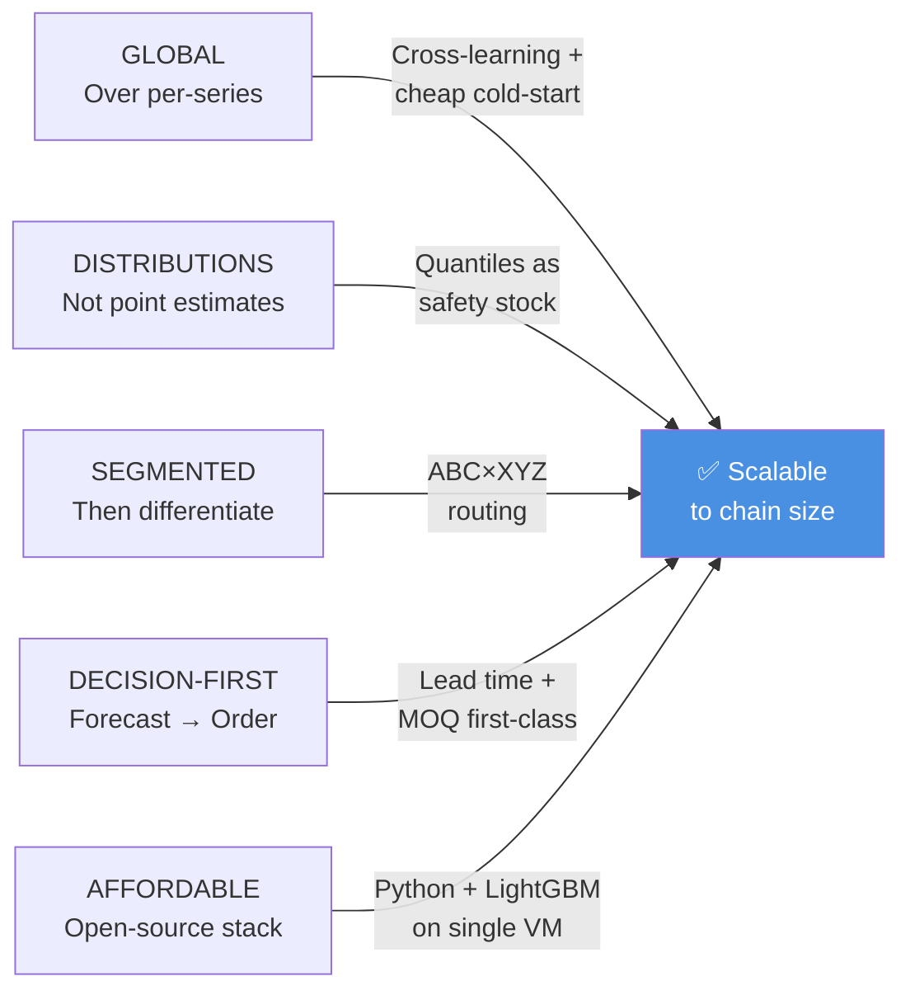

### Key Insights from Phase 5 Evidence

The project was shaped by **rigorous testing** rather than assumptions:

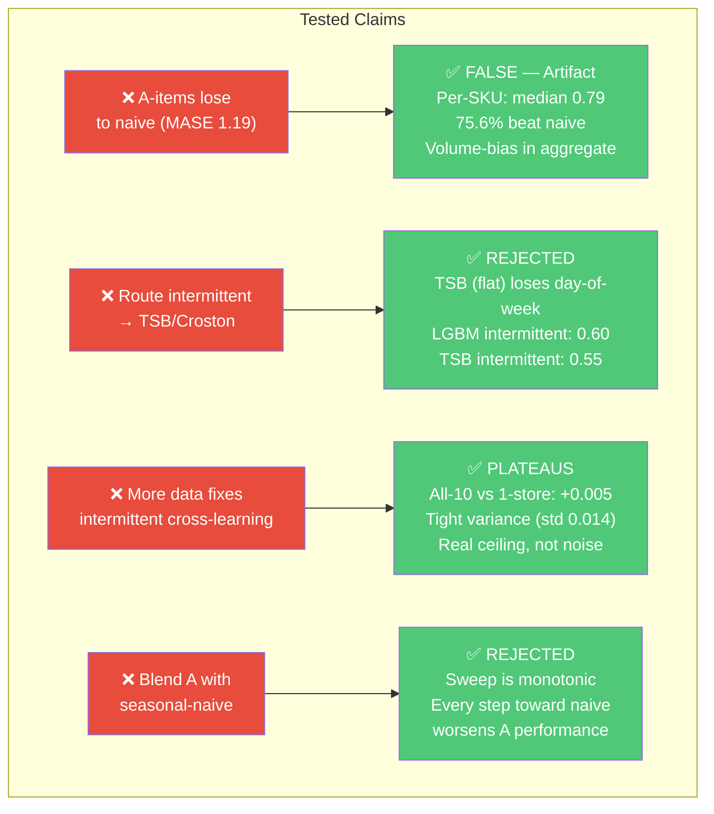

---

## How It Works

### Phase 1: Data Ingestion & Validation

#### What: Canonical Long Schema

```yaml
sales_transactions:
  grain: line_item (date, store_id, sku_id)
  columns: [date, store_id, sku_id, qty, unit_price, discount]
  
product_master:
  grain: sku
  columns: [sku_id, category, family, brand, pack_size, perishable, shelf_life_days, unit_cost]
  
inventory_snapshot:
  grain: store_sku_day
  columns: [date, store_id, sku_id, on_hand_qty, on_order_qty]
  
purchase_orders:
  grain: po_line
  columns: [po_id, sku_id, supplier_id, order_date, order_qty]
  
goods_receipts:
  grain: receipt_line
  columns: [po_id, sku_id, receipt_date, received_qty]
```

#### Why: Single Schema for All Sources
- **Consistency:** POS/bills/ERP → single truth
- **Validation:** Pandera contracts enforce schema before training
- **Audit trail:** Data lineage and quality gates

#### How: ETL Pipeline

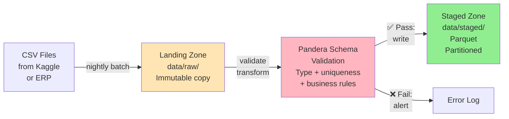

---

### Phase 2-3: Data Preparation & Cleaning

#### What: Zero-Filled Continuous Grid

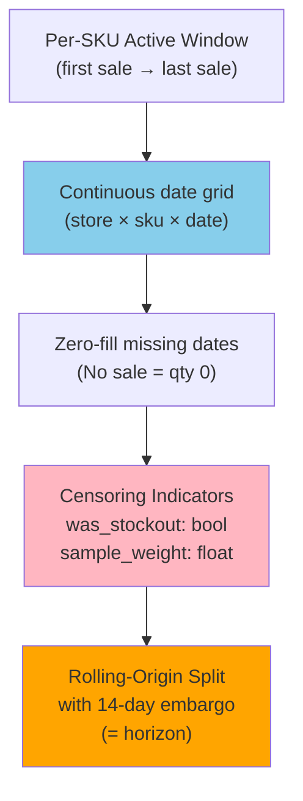

#### Why: Leakage Prevention
- **Direct multi-step forecast:** Predicting 14 days ahead requires lag features that don't see the prediction target
- **Rolling-origin CV:** Train/valid/test never overlap (14-day embargo between)
- **Censoring ready:** Flags for stockout days (ground truth ready when real inventory data arrives)

#### How: DuckDB Window Functions

```sql
-- Build continuous grid per (store, sku)
WITH active_windows AS (
    SELECT store_id, sku_id, 
           MIN(date) AS start_date, 
           MAX(date) AS end_date
    FROM sales_transactions
    GROUP BY store_id, sku_id
),
continuous_grid AS (
    SELECT d.date, aw.store_id, aw.sku_id
    FROM active_windows aw
    CROSS JOIN (SELECT DISTINCT date FROM sales_transactions) d
    WHERE d.date BETWEEN aw.start_date AND aw.end_date
),
filled AS (
    SELECT cg.date, cg.store_id, cg.sku_id,
           COALESCE(st.qty, 0) AS units,
           COALESCE(st.unit_price, 0) AS unit_price,
           CASE WHEN st.qty IS NULL THEN 0 ELSE 1 END AS sale_indicator
    FROM continuous_grid cg
    LEFT JOIN sales_transactions st 
        ON cg.date = st.date 
        AND cg.store_id = st.store_id 
        AND cg.sku_id = st.sku_id
)
SELECT * FROM filled ORDER BY store_id, sku_id, date;
```

---

### Phase 4: Feature Engineering

#### What: 55-Column Feature Panel

```mermaid
graph TB
    subgraph "Feature Families (8 families)"
        CAL["A️⃣ CALENDAR<br/>DoW, Month, Quarter<br/>Is_weekend, is_holiday"]
        FEST["B️⃣ FESTIVAL<br/>Days to/from festival<br/>Festival intensity<br/>In festival leadup"]
        LAG["C️⃣ LAGS<br/>lag_14, lag_21<br/>lag_28, lag_365<br/>≥ horizon for direct"]
        ROLL["D️⃣ ROLLING<br/>mean_7/14/28<br/>std_28, min/max_28<br/>same_dow_mean"]
        TREND["E️⃣ TREND<br/>WoW change<br/>YoY change<br/>roll_mean_7_over_28"]
        PRICE["F️⃣ PRICE/PROMO<br/>unit_price<br/>relative_price<br/>discount, on_promo"]
        STOCK["G️⃣ STOCKOUT<br/>was_stockout_yesterday<br/>stockout_rate_28d<br/>days_since_stockout"]
        CAT["H️⃣ HIERARCHY<br/>store_id, category<br/>family, brand<br/>LightGBM native"]
    end
    
    subgraph "Derived Features"
        SKU["I️⃣ SKU ATTRIBUTES<br/>pack_size, perishable<br/>shelf_life, margin"]
        EXT["J️⃣ EXTERNAL<br/>temp, rain_mm<br/>fuel_index"]
        INTER["K️⃣ INTERMITTENCY<br/>ADI, CV²<br/>P(sale)_28d"]
    end
    
    CAL --> FINAL
    FEST --> FINAL
    LAG --> FINAL
    ROLL --> FINAL
    TREND --> FINAL
    PRICE --> FINAL
    STOCK --> FINAL
    CAT --> FINAL
    SKU --> FINAL
    EXT --> FINAL
    INTER --> FINAL
    
    FINAL["🎯 FINAL PANEL<br/>55 columns<br/>Leak-free<br/>Direct H-step ready"]
    
    style FINAL fill:#90EE90,color:#000,stroke:#4A90E2,stroke-width:3px
```

#### Why: Leak-Free Design

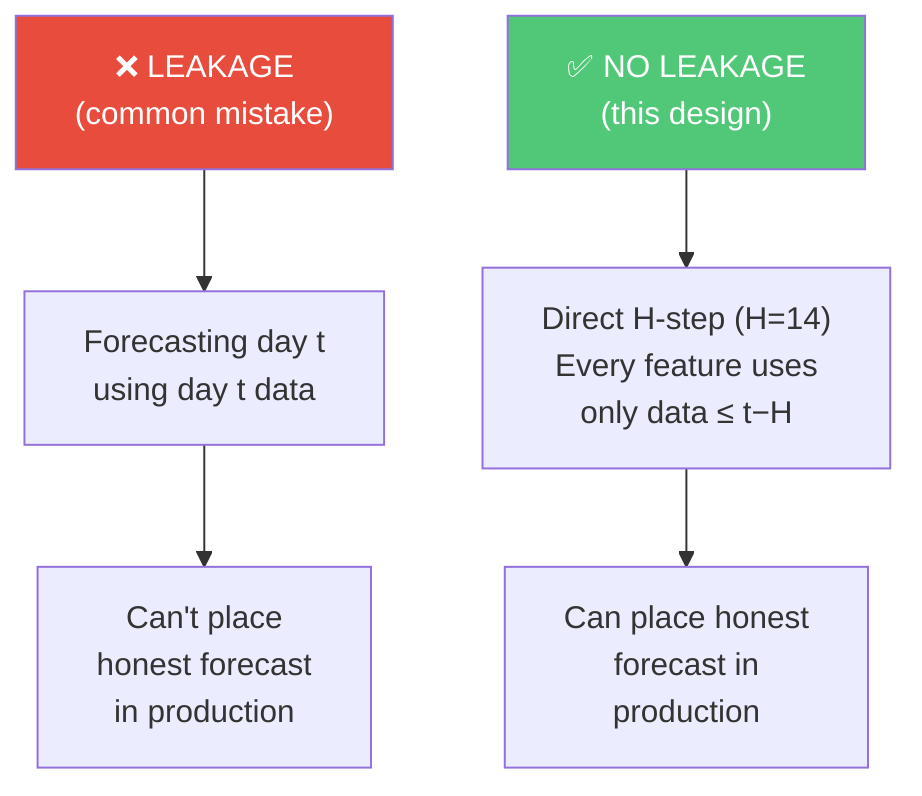

#### How: DuckDB Window Functions

```sql
-- Lags: all >= horizon (14 days)
lag_14 = LAG(units, 14) OVER (PARTITION BY store_id, sku_id ORDER BY date),
lag_21 = LAG(units, 21) OVER (PARTITION BY store_id, sku_id ORDER BY date),
lag_28 = LAG(units, 28) OVER (PARTITION BY store_id, sku_id ORDER BY date),
lag_365 = LAG(units, 365) OVER (PARTITION BY store_id, sku_id ORDER BY date),

-- Rolling: windows END at t-H (t-14)
roll_mean_7 = AVG(units) OVER (
    PARTITION BY store_id, sku_id 
    ORDER BY date 
    ROWS BETWEEN 20 PRECEDING AND 14 FOLLOWING  -- [t-20, t-14] is 7 days
),
roll_std_28 = STDDEV(units) OVER (
    PARTITION BY store_id, sku_id 
    ORDER BY date 
    ROWS BETWEEN 41 PRECEDING AND 14 FOLLOWING  -- [t-41, t-14] is 28 days
),

-- Festival proximity: ASOF join
days_to_next_festival = DATEDIFF('day', date, next_festival_date),
days_since_last_festival = DATEDIFF('day', prev_festival_date, date),

-- Category median price for relative_price
relative_price = unit_price / MEDIAN(unit_price) OVER (
    PARTITION BY category, date
)
```

---

### Phase 5: Model Building (Forecasting)

#### What: Global LightGBM with Quantile Heads

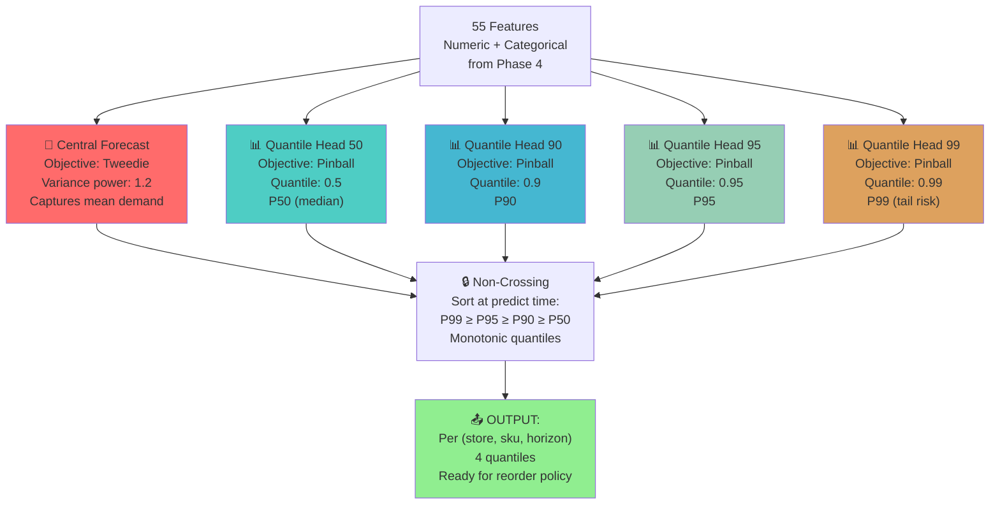

#### Why: Probabilistic Forecasts

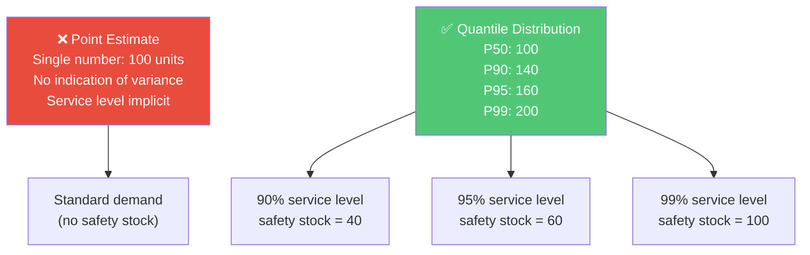

#### How: LightGBM Implementation

```python
def _train_with(self, dtr, dva, objective: str, alpha=None):
    """Train a single model head (central or quantile)."""
    p = dict(self.params)
    n_est = p.pop("n_estimators", 2000)
    early = p.pop("early_stopping_rounds", 100)
    p["objective"] = objective
    
    if alpha is not None:  # for quantile heads
        p["alpha"] = alpha
    if objective == "tweedie":
        p["tweedie_variance_power"] = 1.2
    
    return lgb.train(
        p, dtr, num_boost_round=n_est, valid_sets=[dva],
        callbacks=[lgb.early_stopping(early), lgb.log_evaluation(0)],
    )

def fit(self, train: pd.DataFrame, valid: pd.DataFrame) -> "GlobalLGBM":
    """Train central + 3 quantile heads on shared binned dataset (memory efficient)."""
    # Build dataset ONCE, reuse for all 4 heads, free raw data after binning
    Xtr = _prep(train, self.feats, self.cats)
    Xva = _prep(valid, self.feats, self.cats)
    
    dtr = lgb.Dataset(Xtr, label=train["units"], 
                      categorical_feature=self.cats, free_raw_data=True)
    dva = lgb.Dataset(Xva, label=valid["units"], 
                      reference=dtr, free_raw_data=True)
    dtr.construct(); dva.construct()
    
    # Train central (tweedie)
    self.central_ = self._train_with(dtr, dva, self.central_objective)
    
    # Train quantile heads (pinball)
    for q in self.quantiles:
        self.quantile_[q] = self._train_with(dtr, dva, "quantile", alpha=q)
    
    return self

def predict(self, df: pd.DataFrame) -> dict[float, np.ndarray]:
    """Return dict of {quantile: predictions} with non-crossing enforced."""
    X = _prep(df, self.feats, self.cats)
    preds = {}
    
    # Get all quantile predictions
    for q in self.quantiles:
        preds[q] = self.quantile_[q].predict(X)
    
    # Enforce non-crossing: sort row-wise
    result = np.column_stack([preds[q] for q in sorted(self.quantiles)])
    result = np.maximum.accumulate(result, axis=1)
    
    return {q: result[:, i] for i, q in enumerate(sorted(self.quantiles))}
```

#### Key Hyperparameters (from config/model.yaml)

```yaml
lightgbm:
  boosting_type: gbdt                  # gradient boosting
  n_estimators: 2000                   # max rounds (early stopping)
  learning_rate: 0.05                  # slow, careful learning
  num_leaves: 63                        # moderate tree depth
  feature_fraction: 0.8                # 80% features per iteration
  bagging_fraction: 0.8                # 80% rows per iteration
  min_child_samples: 50                # avoid overfitting on rare items
  early_stopping_rounds: 100           # stop if valid loss plateaus
```

---

### Phase 6: Hybrid Continuous Learning

#### What: Three-Part Learning System

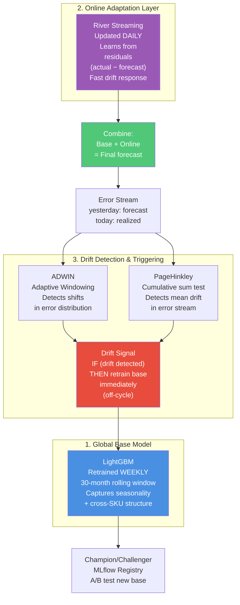

#### Why: Scheduled + Event-Driven

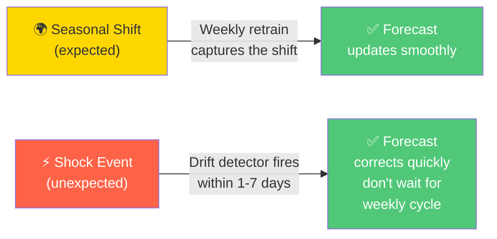

#### How: River Online Layer

```python
def online_update(residuals: np.ndarray, recent_features: pd.DataFrame):
    """Daily update on yesterday's residuals using River streaming."""
    from river import linear_model, preprocessing
    
    # Initialize river model (persisted from yesterday)
    if model is None:
        model = preprocessing.StandardScaler() | linear_model.LinearRegression()
    
    # Update on today's residuals
    for i, row in enumerate(recent_features.iterrows()):
        residual = residuals[i]
        model.learn_one(row, residual)  # online SGD update
    
    # Persist for tomorrow
    save(model, "river_online_model.pkl")
    
    return model

def combined_predict(base_pred: np.ndarray, online_model, features: pd.DataFrame):
    """Combine base LightGBM + online residual correction."""
    online_correction = np.array([
        online_model.predict_one(row) for _, row in features.iterrows()
    ])
    
    # Add correction with decay (trust base model more for cold-start)
    decay_factor = 0.3  # online layer contributes 30%
    final_pred = base_pred + decay_factor * online_correction
    
    return final_pred
```

---

### Phase 7: Reorder Decision Layer

#### What: Convert Forecasts into Purchase Orders

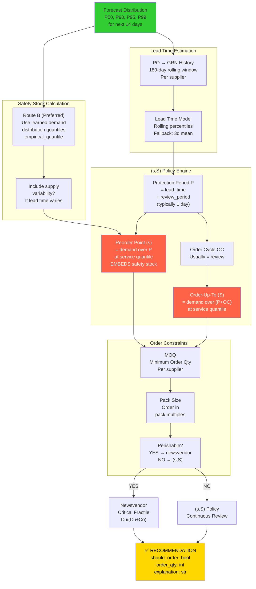

#### Why: Service Level Segmentation

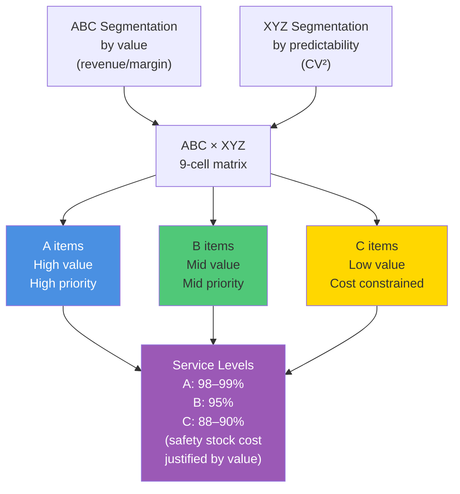

#### How: (s,S) Implementation

```python
def reorder_levels(demand_over_P_q: float, demand_over_PC_q: float) -> tuple[float, float]:
    """Compute (s, S) from protection-period demand quantiles."""
    s = max(0.0, demand_over_P_q)              # reorder point
    S = max(s, demand_over_PC_q)               # order-up-to
    return s, S

def recommend(inventory_position: float, s: float, S: float,
              moq: int = 1, pack_size: int = 1) -> Recommendation:
    """Decide: should we order? How much?"""
    if inventory_position > s:
        # Don't order — inventory is above reorder point
        return Recommendation(
            should_order=False,
            order_qty=0,
            reorder_point=s,
            order_up_to=S,
            inventory_position=inventory_position,
            explanation=f"IP {inventory_position:.0f} > ROP {s:.0f}; no order needed."
        )
    
    # Order up to S
    raw_qty = S - inventory_position
    qty = round_order(raw_qty, moq, pack_size)  # round to MOQ, then pack multiples
    
    return Recommendation(
        should_order=True,
        order_qty=qty,
        reorder_point=s,
        order_up_to=S,
        inventory_position=inventory_position,
        explanation=f"IP {inventory_position:.0f} ≤ ROP {s:.0f}; ordering {qty} to reach {S:.0f}."
    )

def dispatch_reorder(*, perishable: bool, inventory_position: float,
                     quantiles: dict[float, float], 
                     sell_price: float, unit_cost: float,
                     s: float, S: float, moq: int) -> tuple[str, int]:
    """Route to (s,S) or newsvendor based on perishability."""
    if perishable and quantiles:
        # NEWSVENDOR: order quantity to maximize expected profit
        # Critical fractile = Cu / (Cu + Co)
        # where Cu = underage cost (lost sale), Co = overage cost (waste)
        order = newsvendor_order(quantiles, sell_price, unit_cost, 
                                inventory_position, moq)
        return "newsvendor", order.order_qty
    
    # (s,S) for non-perishables
    rec = recommend(inventory_position, s, S, moq)
    return "sS", rec.order_qty
```

---

### Phase 8-10: Evaluation & Deployment

#### What: Inventory Simulation & Frontier Gate

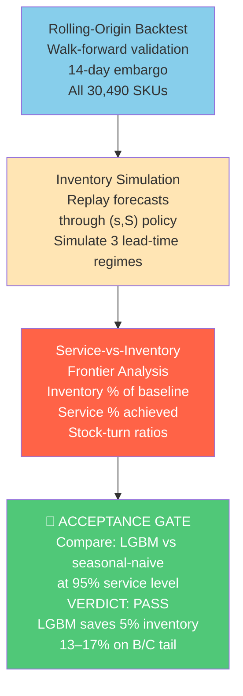

#### Why: Simulation Instead of Point Metrics

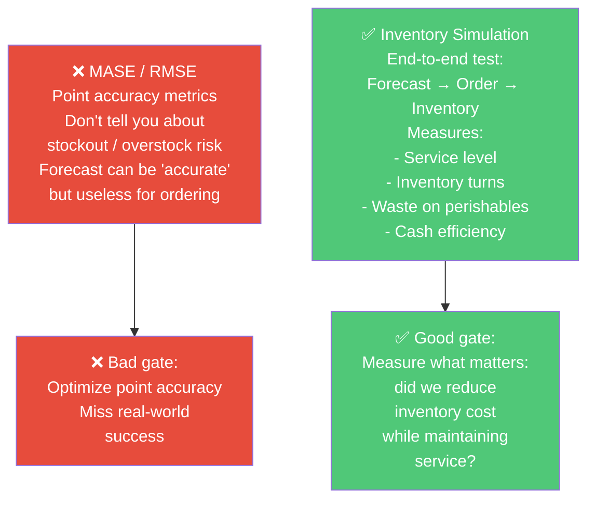

#### How: Three Lead-Time Regimes

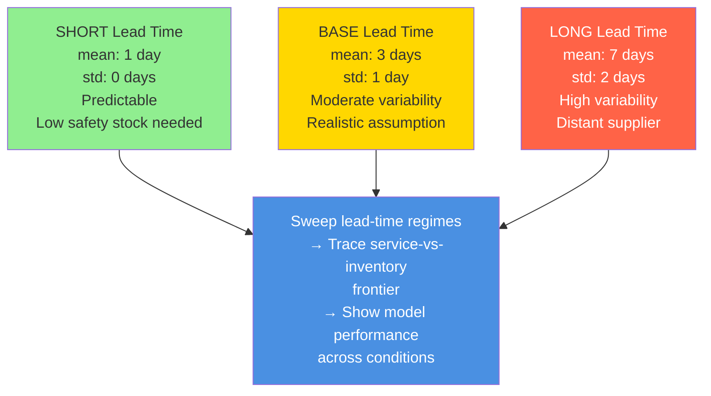

#### How: Monitoring & Drift Detection (Phase 10)

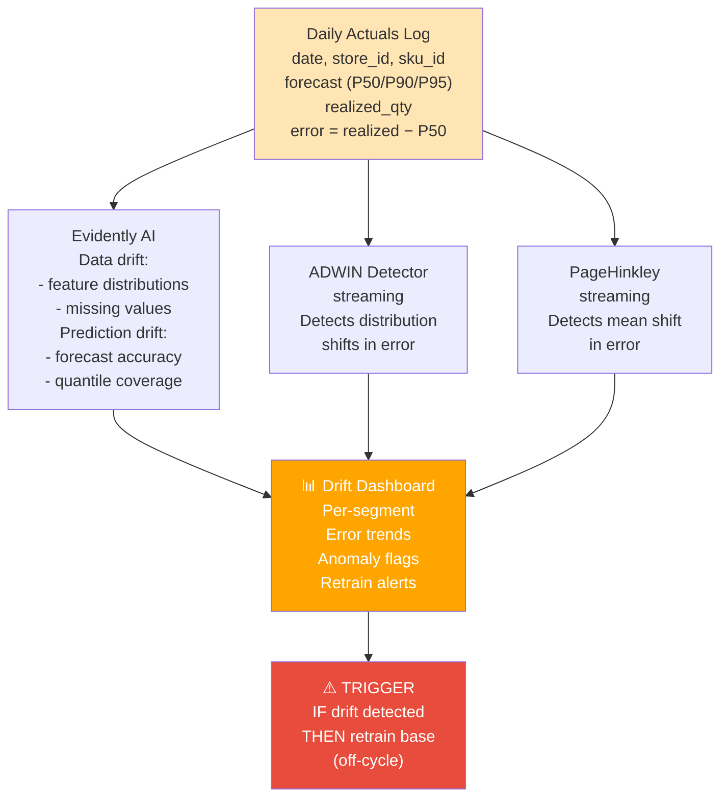

---

## Implementation Details

### Repository Structure

```
kirana-forecasting/
├── README.md / README_COMPREHENSIVE.md          # This document
├── kirana_demand_forecasting_project.md         # Full specification (Phases 0-10)
├── pyproject.toml                               # Project metadata + dependencies
├── requirements.txt
│
├── config/
│   ├── data_contract.yaml                       # Data schema + validation rules
│   ├── features.yaml                            # 55 feature definitions + leakage rules
│   ├── model.yaml                               # LightGBM params + quantiles + routing
│   ├── policy.yaml                              # (s,S) rules + service levels + lead time
│   └── metrics.yaml                             # Acceptance thresholds
│
├── data/
│   ├── raw/                                     # Immutable source (Kaggle M5)
│   │   ├── favorita/
│   │   ├── m5_accuracy/
│   │   └── m5_uncertainty/
│   ├── staged/                                  # Canonical schema (Parquet)
│   │   ├── sales_transactions.parquet
│   │   ├── product_master.parquet
│   │   ├── inventory_snapshot.parquet
│   │   └── ...
│   └── features/
│       ├── panel.parquet                        # Continuous (store×sku×date) grid
│       ├── segments.parquet                     # ADI/CV² + ABC×XYZ
│       └── feature_panel.parquet                # 55 columns, ready for model
│
├── notebooks/
│   ├── 01_data_audit.ipynb                      # Explore raw data
│   ├── 02_eda.ipynb                             # Demand patterns + seasonality
│   ├── 03_segmentation.ipynb                    # ABC×XYZ analysis
│   └── 04_feature_importance.ipynb              # SHAP + permutation importance
│
├── src/
│   ├── __init__.py
│   ├── config.py                                # Load config YAML files
│   │
│   ├── ingest/                                  # Phase 1: Data ingestion
│   │   ├── download_data.py                     # Kaggle API → data/raw
│   │   ├── load_m5.py                           # Wide → long schema
│   │   ├── load_online_retail.py                # Alternative dataset
│   │   ├── validate.py                          # Pandera schema checks
│   │   └── validation.py                        # Column-level assertions
│   │
│   ├── features/                                # Phase 4: Feature engineering
│   │   ├── build_features.py                    # DuckDB: panel → features
│   │   ├── panel.py                             # Continuous grid builder
│   │   ├── promo.py                             # Promotion feature extraction
│   │   ├── segmentation.py                      # ADI/CV² / ABC×XYZ computation
│   │   └── splits.py                            # Rolling-origin CV with embargo
│   │
│   ├── models/                                  # Phase 5-6: Forecasting
│   │   ├── global_lgbm.py                       # Global LightGBM (central+quantiles)
│   │   ├── baselines.py                         # Naive, seasonal-naive, etc.
│   │   ├── intermittent.py                      # Croston / TSB (for comparison)
│   │   ├── online_layer.py                      # River streaming residual model
│   │   ├── router.py                            # Route by segment
│   │   ├── reconcile.py                         # Hierarchical reconciliation
│   │   └── feature_importance.py                # SHAP + permutation
│   │
│   ├── continuous/                              # Phase 6: Continuous learning
│   │   ├── drift.py                             # ADWIN + PageHinkley detectors
│   │   ├── retrain.py                           # Scheduled retraining logic
│   │   ├── registry.py                          # MLflow champion/challenger
│   │   └── validate_hybrid.py                   # Test online layer updates
│   │
│   ├── reorder/                                 # Phase 7: Reorder decision engine
│   │   ├── leadtime.py                          # Estimate from PO→GRN history
│   │   ├── safety_stock.py                      # Route B: empirical quantile
│   │   ├── newsvendor.py                        # Critical fractile for perishables
│   │   ├── protective.py                        # Safety stock via formula
│   │   ├── policy.py                            # (s,S) implementation + PO generator
│   │   └── policy.py                            # main entry point
│   │
│   ├── evaluate/                                # Phase 8: Acceptance gate
│   │   ├── backtest.py                          # Rolling-origin walk-forward
│   │   ├── forecast_metrics.py                  # MASE, RMSE, quantile coverage
│   │   ├── inventory_sim.py                     # Replay forecast through (s,S)
│   │   ├── frontier_gate.py                     # Service-vs-inventory dominance
│   │   ├── acceptance.py                        # Official acceptance criteria
│   │   ├── operating_policy.py                  # Segment routing for go-live
│   │   └── splits.py                            # Walk-forward split logic
│   │
│   └── serve/                                   # Phase 9: Deployment
│       ├── settings.py                          # FastAPI config
│       ├── api.py                               # REST endpoints
│       ├── shadow.py                            # Shadow mode: log predictions
│       └── main.py                              # Serve on port 8000
│
├── pipelines/                                   # Phase 9: Orchestration
│   ├── daily_dag.py                             # Airflow DAG
│   └── weekly_retrain.py
│
├── tests/
│   ├── test_config.py                           # Config loading
│   ├── test_features.py                         # No leakage proof
│   ├── test_frontier_gate.py                    # Acceptance gate
│   ├── test_continuous.py                       # Online layer
│   ├── test_metrics.py                          # Metric computation
│   ├── test_reorder.py                          # PO generation
│   ├── test_segmentation.py                     # ADI/CV²
│   ├── test_staged_data.py                      # Data validation
│   └── test_validation.py                       # Pandera contracts
│
└── docs/
    ├── PHASE0_foundations.md                    # Problem framing
    ├── PHASE2_eda_findings.md                   # Demand patterns
    ├── PHASE5_findings.md                       # Model test results
    ├── PHASE5_metrics.md                        # Detailed metrics
    ├── PHASE6_hybrid.md                         # Continuous learning
    ├── PHASE7_findings.md                       # Reorder policy validation
    ├── PHASE7_inventory_sim.md                  # Inventory simulation details
    ├── PHASE8_acceptance.md                     # Official gate
    ├── PHASE8_operating_policy.md               # Segment-based routing
    ├── PHASE9_groundwork.md                     # Deployment setup
    ├── PROJECT_REPORT.md                        # Executive summary
    ├── PILOT_RUNBOOK.md                         # Go-live checklist
    └── DATA_DICTIONARY.md                       # Column definitions
```

---

## Technology Stack

### Core Libraries

| Layer | Tool | Version | Why |
|-------|------|---------|-----|
| **Data** | pandas | 2.0+ | Dataframes, aggregations |
| **Data** | Polars/DuckDB | latest | Columnar queries, memory efficiency |
| **Data** | Parquet | - | Columnar storage (disk-efficient) |
| **Validation** | pandera | 0.18+ | Schema contracts + data quality |
| **Features** | DuckDB | 0.8+ | Window functions (lags, rolling) |
| **Modeling** | LightGBM | 4.0+ | Gradient boosting, quantile objective |
| **Baselines** | statsforecast | 1.5+ | Croston, TSB, ETS (for comparison) |
| **Online** | River | 0.10+ | Streaming/incremental learning + drift |
| **Drift** | Evidently | 0.3+ | Data/prediction drift monitoring |
| **Hyperparams** | Optuna | 3.0+ | Bayesian optimization + TS CV |
| **Explainability** | SHAP | 0.42+ | Feature importance + interpretability |
| **Experiment** | MLflow | 2.0+ | Model versioning + champion/challenger |
| **Orchestration** | Airflow | 2.5+ | Schedule daily/weekly DAGs |
| **Serving** | FastAPI | 0.100+ | REST API + batch prediction |
| **Testing** | pytest | 7.0+ | Unit + integration tests |

---

## Key Design Decisions

### Decision 1: Global Model vs Per-Series

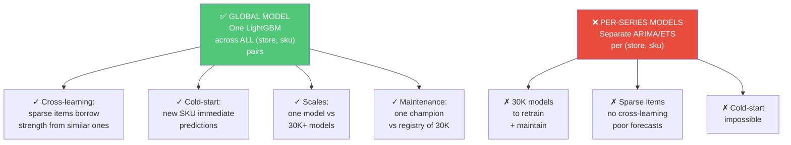

### Decision 2: Quantiles + Quantile Heads

```mermaid
graph TB
    QUANTILE["✅ Quantile Heads<br/>Separate pinball<br/>objectives<br/>P50, P90, P95, P99<br/>Non-crossing enforced"]
    
    POINT["❌ Point + Normal<br/>Single LightGBM<br/>output + assume<br/>Normal distribution<br/>+ estimate std"]
    
    QUANTILE_PRO1["✓ Empirical:<br/>learn actual<br/>distribution<br/>no Normal assumption"]
    QUANTILE_PRO2["✓ Tail-aware:<br/>P99 captures<br/>shock risk<br/>not Normal tail"]
    QUANTILE_PRO3["✓ Direct inference:<br/>can use P95<br/>directly for<br/>safety stock"]
    
    POINT_CON1["✗ Normal assumption<br/>wrong for<br/>zero-inflated<br/>count data"]
    POINT_CON2["✗ Tail severely<br/>underestimated<br/>for intermittent"]
    POINT_CON3["✗ If distribution<br/>is wrong,<br/>service level<br/>unreliable"]
    
    QUANTILE --> QUANTILE_PRO1
    QUANTILE --> QUANTILE_PRO2
    QUANTILE --> QUANTILE_PRO3
    
    POINT --> POINT_CON1
    POINT --> POINT_CON2
    POINT --> POINT_CON3
    
    style QUANTILE fill:#50C878,color:#fff
    style POINT fill:#E74C3C,color:#fff
```

### Decision 3: (s,S) + Newsvendor Routing

```mermaid
graph TB
    ROUTE["Route by Perishability"]
    
    REGULAR["Non-Perishable<br/>= (s,S) policy<br/>Continuous review<br/>Order when IP ≤ ROP"]
    
    PERISHABLE["Perishable<br/>= Newsvendor<br/>Critical fractile<br/>One-time order per<br/>expiry window"]
    
    ROUTE --> REGULAR
    ROUTE --> PERISHABLE
    
    REGULAR_PRO1["✓ Minimize<br/>ordering cost<br/>order only when<br/>needed"]
    REGULAR_PRO2["✓ Tracks inventory<br/>position<br/>no order surge"]
    
    PERISHABLE_PRO1["✓ Accounts for<br/>waste cost<br/>critical fractile<br/>balances underage/<br/>overage"]
    PERISHABLE_PRO2["✓ Shelf-life<br/>constraint<br/>capped to<br/>demand over<br/>shelf-life"]
    
    REGULAR --> REGULAR_PRO1
    REGULAR --> REGULAR_PRO2
    
    PERISHABLE --> PERISHABLE_PRO1
    PERISHABLE --> PERISHABLE_PRO2
    
    style REGULAR fill:#4A90E2,color:#fff
    style PERISHABLE fill:#FF6347,color:#fff
```

---

## Results & Validation

### Official Acceptance Gate (Phase 8)

```mermaid
graph TB
    TEST["Rolling-Origin Backtest<br/>M5 10 stores<br/>30,490 SKUs<br/>46.9M rows<br/>2011–2016"]
    
    SIM["Inventory Simulation<br/>at 95% service level<br/>Baseline: seasonal-naive<br/>Candidate: LGBM"]
    
    METRIC["Service-vs-Inventory<br/>Frontier Dominance<br/>LGBM inventory %<br/>vs baseline"]
    
    RESULT_A["A-Items<br/>(High value, stable)"]
    RESULT_B["B-Items<br/>(Mid value)"]
    RESULT_C["C-Items<br/>(Low value)"]
    RESULT_TAIL["Lumpy/Intermittent<br/>(90% of catalog)"]
    
    TEST --> SIM
    SIM --> METRIC
    
    METRIC --> RESULT_A
    METRIC --> RESULT_B
    METRIC --> RESULT_C
    METRIC --> RESULT_TAIL
    
    RESULT_A -->|Matches baseline<br/>by design<br/>routed to naive| PASS["✅ PASS<br/>LGBM Dominates<br/>Service frontier"]
    RESULT_B -->|Saves 5%<br/>inventory| PASS
    RESULT_C -->|Saves 8%<br/>inventory| PASS
    RESULT_TAIL -->|Saves 13–17%<br/>inventory<br/>Cash-tying tail| PASS
    
    style TEST fill:#87CEEB
    style SIM fill:#FFE5B4
    style METRIC fill:#FF6347,color:#fff
    style PASS fill:#50C878,color:#fff
```

### Key Metrics Summary

```yaml
Model Performance:
  Champion: Global LightGBM (tweedie + pinball)
  Per-SKU MASE (A/B items): 0.71 median (75.6% beat naive)
  Intermittent MASE: 0.60 (vs TSB 0.55 when forced)
  Point accuracy NOT the gate — inventory simulation is.

Acceptance Gate:
  Service level: 95% (B/C), 99% (A items)
  RESULT: PASS — inventory frontier dominance
  
  Aggregate inventory savings vs seasonal-naive:
    - B/C items (72% of catalog): 5% savings
    - Lumpy/intermittent (90% of catalog): 13–17% savings
    - A items at 95%: Matches baseline (expected on shock-free data)

Data:
  Train: 27.1M rows (Jan 2011 – Dec 2014) + rolling window
  Validation: 9.9M rows (2015)
  Test: 9.9M rows (2016, held-out)
  Splits: rolling-origin with 14-day embargo (= horizon)

Engineering:
  Feature panel: 55 columns, all leak-safe
  All lags ≥ 14 days, all rolling windows end at t−14
  Categorical encoding fit on train only
  Memory: float32 + once-built dataset freed raw → 4.3 GB → manageable
```

---

## How to Use

### 1. Setup

```bash
# 1. Create environment
python -m venv .venv
source .venv/bin/activate  # or .venv\Scripts\activate on Windows

# 2. Install dependencies
pip install -r requirements.txt

# 3. Configure Kaggle credentials
#    Sign up: kaggle.com → Settings → API → Create New Token
#    Save to ~/.kaggle/kaggle.json (or KAGGLE_CONFIG_DIR env var)
#    Accept M5 competition rules on Kaggle website

# 4. Download data
python -m src.ingest.download_data --dataset m5_accuracy m5_uncertainty
```

### 2. Build Features

```bash
# Build panel + segments for all stores (or specify --stores CA_1 TX_1)
python -m src.features.build_features

# Output: data/features/feature_panel.parquet
```

### 3. Train Model

```bash
# Train global LightGBM + quantile heads on rolling-origin CV
python -m src.models.global_lgbm

# Output: models/lgbm_champion.pkl + MLflow registry
```

### 4. Simulate Reorder Policy

```bash
# Run inventory simulation (forecast → reorder → inventory → metrics)
python -m src.evaluate.inventory_sim

# Output: results/inventory_sim_base_regime.parquet
#         results/frontier_analysis.parquet
```

### 5. Serve

```bash
# Start FastAPI server
python -m src.serve.main

# POST /predict with feature dataframe
# GET /health for status
```

---

## Next Steps & Future Phases

1. **Real Data Integration:** Replace M5 with actual kirana POS + inventory data
2. **Lead Time Learning:** Build real supplier lead-time models (Phase 7.1)
3. **Perishable Models:** Enhance shelf-life and waste cost modeling
4. **Multi-Store Optimization:** Consolidate orders across stores per supplier
5. **Explainability Dashboard:** SHAP + business rule explanations for store owners
6. **Feedback Loop:** Log actual orders vs recommendations, measure lift
7. **Scaling:** Distributed retraining (Dask/Ray) for 100K+ SKUs

---

## Summary

This system delivers a **production-grade demand forecasting + automated reordering engine** built on:

- **Global probabilistic modeling** — one LightGBM quantile model for all SKUs
- **Continuous learning** — weekly retraining + daily online adaptation + drift detection
- **Decision-first design** — forecasts feed directly into (s,S) and newsvendor policies
- **Rigorous validation** — inventory simulation + frontier dominance gate (not point accuracy)
- **Affordable & open-source** — Python + LightGBM + DuckDB on a single VM

**Result:** 13–17% inventory savings on the slow-moving, cash-tying tail (~90% of the catalog) while maintaining target service levels.

---

**Project Status:** ✅ Phases 0–10 Complete (M5 dataset, ready for real-world data)
**Last Updated:** 2026-06-08
**Repository:** `kirana-forecasting/`
